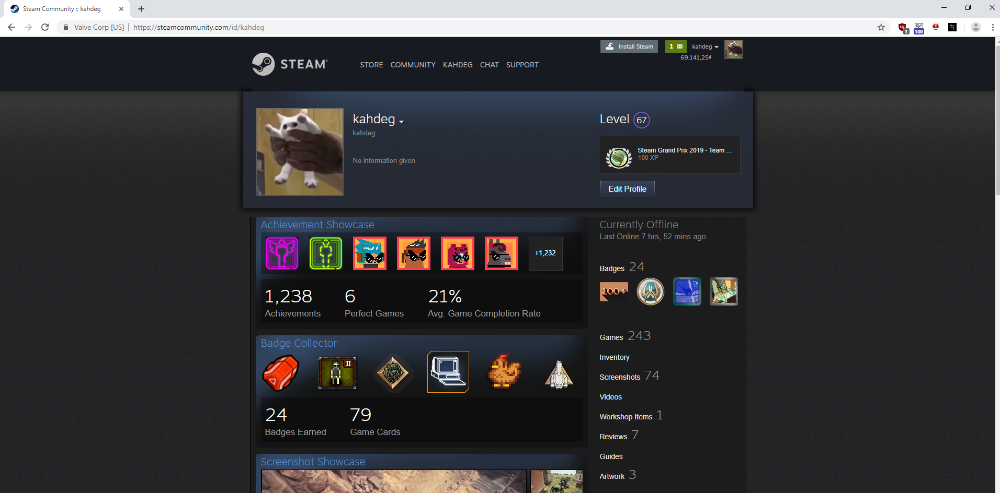
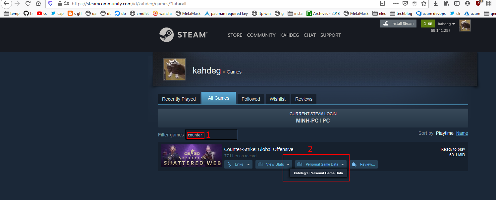
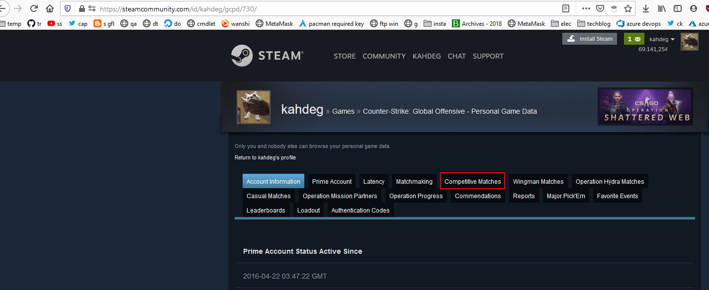
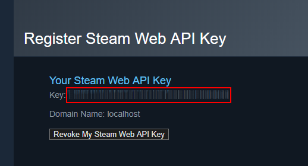
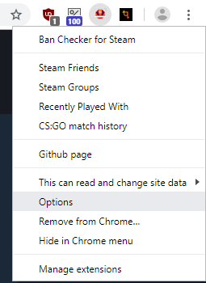
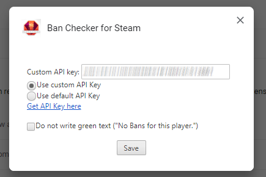

# Cách xem lịch sử matchmaking
## Cách bình thường được cung cấp bởi valve
1. vào profile của m

2. vào game

3. vào lịch sử matchmaking

## Cách setup plugin để xem stat matchmaking
1. cài plugin  
[ban check for steam](https://chrome.google.com/webstore/detail/ban-checker-for-steam/canbadmphamemnmdfngmcabnjmjgaiki)
2. lấy api key

3. vào option

4. lưu key

5. làm theo [Cách bình thường được cung cấp bởi valve](#Cách bình thường được cung cấp bởi valve)